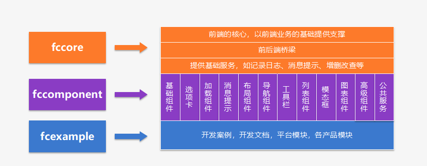
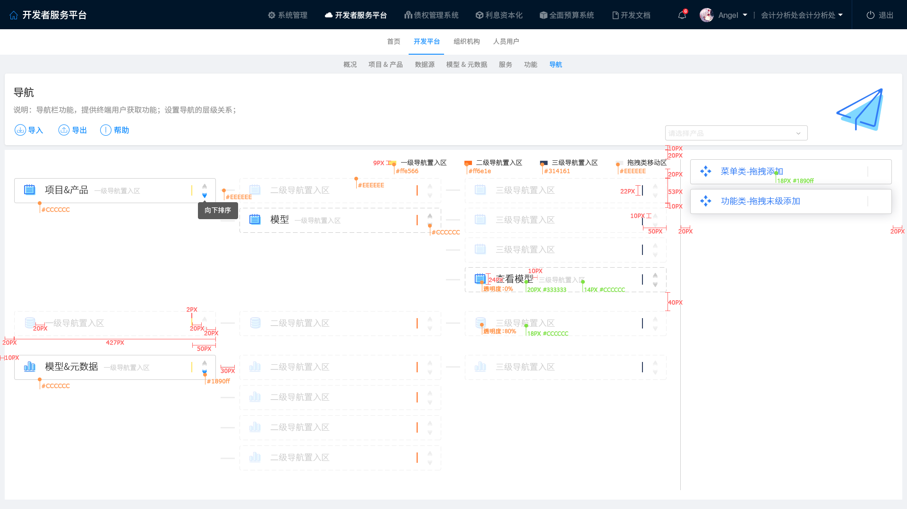

# Fcomponent2组件


- fccomponent2.0是基于蚂蚁金服的Ant Design 1.4版本（跟随ant design升级）作为原始组件，采用angular6的技术框架，结合fccore2.0提供的基础功能，按照各种常用的场景封装的一套组件的产品。它包含基础输入，展示型、选项卡、加载条、提示消息、导航、工具栏、阻断式模态框、列表、图表、高级组件等12大分类75个组件，及抽象父类组成；此组件库产品主要是为日常开发过程中常用的场景提供一整套的组件，便于各产品线编码统一风格，统一思想，统一体系；也为各项目产品提供持续性平滑升级；核心思路:提供两套绑定思路，实现数据与组件的绑定，一种是绑定模型（也称元数据）组件内部完成数据的请求和响应，另外一种是数据由开发人员手动编码的方式从后端获取，通过属性绑定的方式写入到组件内部。



> ## 版本

- 2018-09-13 
```javascript 
npm i fccomponent@2.0.3
```

>  ## npm网址

[fccomponent2](https://www.npmjs.com/package/fccomponent2)

> ## 平台组件示例

```html
<!-- 按钮组件 -->
<fc-button fcLabel="这是一个按钮" fcType="primary"></fc-button>
```

```javascript
/**
  * 根据appid和appname获取当前元数据的ID
  * @param appid 
  * @param appname 
  */
  static getID(appid, appname): Observable<any> {
    return this.appService.findWithQuery("SYSAPP", { WHERE: "{APPID:{eq:'" + appid + "'},{APPNAME:{eq:'" + appname + "'}" })
  }
 

``` 

> ## 平台规范接口
1. listinfo 
2. create
3. update
4. remove
5. infolist 
6. importexcel
7. exportexcel
8. ......


> ## fccomponent依赖于fccore

- fccore2.0是前端的核心，以前端业务的基础提供支撑
- 前后端桥梁
- 提供基础服务，如记录日志、消息提示、增删改查等
- fccore2是前端模型层产品，是前端的核心，采用angular6.0的技术框架；其为前端的视图及控制层提供底层支持，是前后端的桥梁。
- fccore2.0前端核心API文档如下
1. DaoService(提供http访问)
2. AppService(提供获取元数据模型结构关系能力，包含数据字典，单表的增删改查操作，以及具有元数据模型的交互能力)
3. CacheService（缓存处理，前端缓存的处理操作）
4. CommonService(MD5，base64工具类，日期处理等)
5. LogService(日志功能，前端日志的记录及收集）
6. UserService（用户注册登录，用户相关的业务）
7. AuthService（权限服务）、MenuService（菜单导航服务）
8. MessageService（消息服务
9. ProvidersService（公共注入服务类,集成DaoService,AppService，UserService,LogService,MenuService，MessageService）
10. ParentBusiness（自定义业务基类，所有业务服务的基类，集成ProviderService，所有业务子类都通过直接调用服务以达到访问http，websocket，日志，元数据模型，消息，菜单等服务）；


- 注：其中, CacheService、CommonService是两个静态工具类，任何需要使用的代码中直接调用
> ##  一、DaoService (提供http访问)

```javascript

import { HttpClient } from '@angular/common/http';
import { ResponseResult, Fcconfig } from '../common/classes';
import { Observable } from 'rxjs';
export declare const FCCONFIG: Fcconfig;
export declare class DaoService {
    http: HttpClient;
    ws: WebSocket;
    constructor(http: HttpClient);
    /**
     * 获取参数列对象
     * @param param 参数
     * @param isArray 是否是数组 默认为false
     */
    getParamOpt(param: any): any;
    /**
     * 获取默认的参数,url中的参数
     *
     */
    private getDefaultParams;
    /**
     * 根据url及参数获取完成请求url
     * @param url 请求url
     * @param param 参数
     */
    private getUrl;
    /**
     * 执行get查询，如http://ip:port/url?param=
     * @param url 请求全路径
     * @param params 参数内容
     */
    getBase(url: string, params: any): Observable<any>;
    /**
     * 通过post方法
     * @param url 请求资源
     * @param reqOpts 请求参数
     */
    postBase(url: string, body: any, param?: any): Observable<Object>;
    /**
      * 通过post方法
      * @param url 请求资源
      * @param reqOpts 请求参数
      */
    postByParams(url: string, body: any, param?: any): Observable<Object>;
    /**
      * 应用系统接口get请求
      * @param url 请求url，不包含主机及
      * @param params
      */
    getFromApi(url: string, param: any): Observable<ResponseResult>;
    /**
       * 应用系统接口post请求
       * @param url 请求url，不包含主机及
       * @param body 请求体
       * @param param 请求url参数
       */
    postFromApi(url: string, body: any, param?: any): Observable<any>;
    /**
       * 应用系统接口get请求
       * @param url 请求url，不包含主机及
       * @param param
       */
    getFromSystem(url: string, param: any): Observable<any>;
    /**
       * 应用系统接口post请求
       * @param url 请求url，不包含主机及
       * @param body 请求体
       * @param param 请求参数
       */
    postFromSystem(url: string, body: any, param?: any): Observable<any>;
    /**
       * 应用系统接口get请求
       * @param url 请求url，不包含主机及
       * @param param
       */
    getFromLog(url: string, param: any): Observable<any>;
    /**
       * 应用系统接口post请求
       * @param url 请求url，不包含主机及
       * @param body 请求体
       * @param param 请求url参数
       */
    postFromLog(url: string, body: any, param?: any): Observable<any>;
    /**
     * 应用系统接口get请求
     * @param url 请求url，不包含主机及
     * @param param 请求url参数
     */
    getFromAuth(url: string, param: any): Observable<ResponseResult>;
    /**
       * 应用系统接口post请求
       * @param url 请求url，不包含主机及
       * @param body 请求体
       * @param param 请求url参数
       */
    postFromAuth(url: string, body: any, param: any): Observable<any>;
    /**
     * 连接ws并监听消息
     */
    connectionWs(userId: string): Observable<any>;
    /**
     * 发送消息
     * @param message 发送消息体
     */
    sendMessage(message: string): void;
}

```

> ##  二、AppService(提供获取元数据模型结构关系能力，包含数据字典，单表的增删改查操作，以及具有元数据模型的交互能力)

```javascript
import { DaoService } from './dao.service';
import { LogService } from './log.service';
import { ResponseResult, Fcapp } from '../common/classes';
import { Sysappbuttons, Sysappfields } from '../common/beanclass';
import { Observable } from 'rxjs';
export declare class AppService {
    private daoService;
    private logService;
    apps: any[];
    moduleId: string;
    serviceId: string;
    constructor(daoService: DaoService, logService: LogService);
    /**
     * 初始化所有的当前产品的app结构,并存储在缓存中。
     */
    initApp(): void;
    /**
       * 初始化元数据内容，包含元数据的表单配置，列表配置，查询条件配置
       * */
    initOneApp(appId: string): void;
    /**
     * 初始化相关的内容。
     * @param app 当前初始化的元数据对象
     */
    private initAppDetail;
    /**
     * 获取数据默认的数据值
     * @param app
     */
    initObjDefaultValue(app: any): any;
    /**
       * 获取数据默认的数据值
       * @param app
       */
    initObjDefaultConditon(app: Fcapp): any;
    /**
     *
     * 获取APP结构
     * @param appId 资源id
     */
    getAppById(appId: string): Fcapp;
    /**
     * 根据appid获取到应用程序内容
     */
    findAllApp(): Observable<ResponseResult>;
    /**
     * 根据条件获取到应用程序内容
     */
    findAppWithQuery(param: any): Observable<ResponseResult>;
    /**
       * 根据appid获取到应用程序内容
       * @param appid 应用程序
       */
    findAppByAid(appid: string): Observable<ResponseResult>;
    /**
     * 根据元数据id
     * @param appid 应用程序id
     * @param condition
     */
    findWithQuery(appid: string, condition: any): Observable<ResponseResult>;
    /**
     * 根据元数据id
     * @param appid 应用程序id
     * @param condition
     */
    findById(appid: string, id: string): Observable<ResponseResult>;
    /**
     * 根据当前对象的结构提交保存
     * @param appId 元数据id
     * @param obj 当前对象
     */
    saveObject(appId: string, obj: any): Observable<ResponseResult>;
    /**
     * 根据当前对象的结构提交修改
     * @param appId 元数据id
     * @param obj 当前对象
     */
    updateObject(appId: string, obj: any): Observable<ResponseResult>;
    /**
     * 根据当前对象的id删除对象。
     * @param appId 元数据id
     * @param id 元数据对应的对象id
     */
    deleteObject(appId: string, id: string): Observable<ResponseResult>;
    /**
     * 根据当前对象的ids删除对象。
     * @param appId 元数据id
     * @param ids 元数据对应的对象id where数组
     */
    deleteObjects(appId: string, ids: any[]): Observable<ResponseResult>;
    /**
     * 获取请求url
     * @param app 元数据对象
     * @param act 执行方法
     */
    private getUrl;
    /**
     *
     * @param appId 当前资源id
     * @param btnType btn按钮类型['CARD','LIST','LISTONE']
     */
    getBtnByAppid(appId: string, btnType: string): Sysappbuttons[];
    /**
    *
    * @param appId 当前资源id
    * @param btnType btn按钮类型['CARD','LIST','LISTONE']
    */
    getBtnByApp(app: Fcapp, btnType: string): Sysappbuttons[];
    /**
     * 根据元数据id获取表单字段列
     * @param appId 元数据id
     */
    getFormFieldsByAppid(appId: string): Sysappfields[];
    /**
     * 根据元数据id获取列表字段列
     * @param appId 元数据id
     */
    getListFieldsByAppid(appId: string): Sysappfields[];
    /**
     * 根据元数据获取表单字段列
     * @param app 元数据
     */
    getFormFieldsByApp(app: Fcapp): Sysappfields[];
    /**
     * 根据元数据获取列表字段列
     * @param app 元数据
     */
    getListFieldsByApp(app: Fcapp): Sysappfields[];
    /**
     * 获取满足字段key的值为value的所有字段
     * @param appId 元数据id
     * @param key 字段名称
     * @param value 字段值 可以是number，string等类型
     */
    getFieldsByAppid(appId: string, key: string, value: any): Sysappfields[];
    /**
     * 获取满足字段key的值为value的所有字段
     * @param app 元数据
     * @param key 字段名称
     * @param value 字段值 可以是number，string等类型
     */
    getFieldsByApp(app: Fcapp, key: string, value: any): Sysappfields[];
    /**
     * 根据元数据id获取表单按钮
     * @param appId 元数据id
     */
    getFormButtonsByAppid(appId: string): Sysappbuttons[];
    /**
     * 根据元数据id获取工具栏按钮
     * @param appId 元数据id
     */
    getToolbarButtonsByAppid(appId: string): Sysappbuttons[];
    /**
     * 根据元数据id获取获取列表明细按钮
     * @param appId 元数据id
     */
    getListButtonsByAppid(appId: string): Sysappbuttons[];
    /**
     * 获取满足字段key的值为value的所有按钮
     * @param appId 元数据id
     * @param key 字段名称
     * @param value 字段值 可以是number，string等类型
    */
    getButtonsByAppid(appId: string, key: string, value: any): any;
    /**
     * 根据元数据获取表单按钮
     * @param app 元数据
     */
    getFormButtonsByApp(app: Fcapp): Sysappbuttons[];
    /**
     * 根据元数据获取工具栏按钮
     * @param app 元数据
     */
    getToolbarButtonsByApp(app: Fcapp): Sysappbuttons[];
    /**
     * 根据元数据获取获取列表明细按钮
     * @param app 元数据
     */
    getListButtonsByApp(app: Fcapp): Sysappbuttons[];
    /**
       * 获取满足字段key的值为value的所有按钮
       * @param app 元数据
       * @param key 字段名称
       * @param value 字段值 可以是number，string等类型
       */
    getButtonsByApp(app: Fcapp, key: string, value: any): Sysappbuttons[];
    /**
     * 根据字段名称获取字段内容
     * @param appId 元数据id
     * @param fieldCode 字段名称
     */
    getFieldByFieldcode(appId: string, fieldCode: string): Sysappfields;
    /**
     * 根据字段名称获取字段内容
     * @param app 元数据
     * @param fieldCode 字段名称
     */
    getFieldByAppFieldcode(app: Fcapp, fieldCode: string): Sysappfields;
    /**
     * 根据资源id及数据字典编码获取数据字典项列表
     * @param appId 当前资源id
     * @param diccode 数据字典编码
     */
    getDicByDiccode(appId: string, diccode: string): any[];
    /**
     * 根据资源id及数据字典编码获取数据字典项列表
     * @param app 元数据
     * @param diccode 数据字典编码
     */
    getDicByAppDiccode(app: Fcapp, diccode: string): any[];
    /**
     * 根据字段名称获取数据字典列表
     * @param appId 元数据id
     * @param fieldCode 字段名称
     */
    getDicByFieldcode(appId: string, fieldCode: string): any;
    /**
     * 根据字段名称获取数据字典列表
     * @param app 元数据
     * @param fieldCode 字段名称
     */
    getDicByAppFieldcode(app: Fcapp, fieldCode: string): any;
    /**
     * 获取元数据对应的字段数据字典 返回单个对象
     * 仅限静态字典
     * @param appId 元数据id
     */
    getDicByAppid(appId: string): any;
    /**
     * 根据数据字典获取数据美容
     * @param fieldDic
     * @param value
     */
    getDicdescByFieldCode(fieldDic: any, value: string): any;
    /**
     * 根据资源id及参照字典编码获取参照字典项列表
     * @param appId 当前资源id
     * @param diccode 参照字典编码
     */
    getDicAppByDiccode(appId: string, diccode: string): any[];
    /**
     * 根据资源id及参照字典编码获取参照字典项列表
     * @param app 元数据
     * @param diccode 参照字典编码
     */
    getDicAppByAppDiccode(app: Fcapp, diccode: string): any[];
    /**
     * 根据字段名称获取参照字典列表
     * @param appId 元数据id
     * @param fieldCode 字段名称
     */
    getDicAppByFieldcode(appId: string, fieldCode: string): any;
    /**
     * 根据字段名称获取参照字典列表
     * @param app 元数据
     * @param fieldCode 字段名称
     */
    getDicAppByAppFieldcode(app: Fcapp, fieldCode: string): any;
    /**
     * 获取元数据对应的字段参照字典 返回单个对象
     * 仅限静态字典
     * @param appId 元数据id
     */
    getDicAppByAppid(appId: string): any;
    /**
     * 根据参照字典获取数据美容
     * @param fieldDic
     * @param value
     */
    getDicAppdescByFieldCode(fieldDic: any, value: string): any;
    /**
      * 根据元数据创建默认接口
      * @param appId 元数据id
      */
    createinterfacebyappid(appId: string): void;
}

```

> ##  三、CacheService（缓存处理，前端缓存的处理操作）

```javascript

export default class CacheService {
    static set(key: string, value: any): void;
    static get(key: string, defaultValue?: any): any;
    static clear(): void;
    static clearByKey(key: any): void;
    static setS(key: string, value: any): void;
    static getS(key: string, defaultValue?: any): any;
    static clearS(): void;
    static clearSByKey(key: any): void;
    static objToString(obj: any): string;
}


```

> ##  四、 CommonService(MD5，base64工具类，日期处理等)

```javascript

import { Observable, ObservableInput } from 'rxjs';
export declare class CommonService {
    private static eventEmit;
    /**
     * 发生事件
     * @param eventName 事件名称
     * @param param 参数名称
     */
    static event(eventName: string, param: any, token?: string): void;
    /**
     * 订阅事件
     * @param eventName 事件名称
     * @param func 执行回调方法
     */
    static subscribe(eventName: string, func: Function): void;
    /**
     *
     * 订阅事件，并执行process，之后根据事件提供的token把proeces处理的结构值发送至token事件；
     * @param eventName 事件名称
     * @param process 处理流事件
     */
    static subscribePEventByToken(eventName: string, process: Observable<any>): void;
    /**
     * 订阅事件
     * @param eventName 事件句柄
     * @param processes 执行的流事件集合
     * @param token 响应的事件名称
     */
    static subscribePsEventByToken(eventName: string, processes: Observable<any>[]): void;
    /**
    * 订阅事件
    * @param eventName 事件句柄
    * @param process 执行的事件流
    * @param token 响应的事件名称
    */
    static subscribeToken(eventName: string, process: Observable<any>, token: string): void;
    /**
     * 获取guid，去掉中划线
     */
    static guid(): string;
    private static base64EncodeChars;
    private static base64DecodeChars;
    /**
     * base64编码
     * @param {Object} str
     */
    private static base64encode;
    /**
     * base64解码
     * @param {Object} str
     */
    private static base64decode;
    /**
     * utf16转utf8
     * @param {Object} str
     */
    private static utf16to8;
    /**
    * utf8转utf16
    * @param {Object} str
    */
    private static utf8to16;
    /**
    * 加密
    */
    static enCode64(str: any): any;
    /**
    * base64解密
    */
    static deCode64(str: any): any;
    /**
     * 根据模块及资源获取到url
     * @param moduleId 模块id
     * @param resId 资源id
     */
    static getUrlBy(moduleId: string, resId: string, act: string): string;
    /**
     * 获取随机数
     * @param n 范围内的数值
     */
    static Random(n: any): string;
    /**
     * 获取当前时间戳
     */
    static getMilliseconds(): number;
    /**
     * 获取时间戳
     * @param date 当前时间
     */
    static getMillisecondsFromDate(date: string): number;
    /**
     * 秒数转时间
     * @param seconds 秒数
     */
    static getDateByMilliseconds(seconds: number): Date;
    /**
     * 获取当前时间秒数
     */
    static getTimestamp(): number;
    /**
     * 根据指定日期获取秒数
     * @param date 指定日期
     */
    static getTimestampFromDate(date: string): number;
    /**
     * 秒数转日期
     * @param seconds 秒数
     */
    static getDateByTimetamp(seconds: number): Date;
    /**
     * 获取当前年月
     * @param seg 分隔符 / -
     */
    static getYearMonth(seg?: string): string;
    /**
     * 获取当前年月日
     * @param seg 分隔符
     */
    static getDate(seg?: string): string;
    /**
     * 时间格式化处理
     * @param 格式化字符串
     * @param 格式化日期格式化
     * */
    static dateFormat(date: Date, fmt: string): string;
    /**
     * 时间格式化处理
     * @param 格式化字符串
     * @param 格式化日期格式化
     * */
    static stringDateFormat(dateStr: string, fmt: string): string;
    /**
     * 时间戳格式化处理
     * @param 格式化
     * @param 时间戳
     * */
    static timestampFormat(timestamp: number, fmt: string): string;
    /**
       * 字符串转时间（yyyy-MM-dd HH:mm:ss、yyyy/M/d HH:mm:ss、yyyyMMddHHmmss、yyyyMMddHHmm、yyyyMMdd）
       * result （分钟）
       */
    static stringToDate(fDate: string): Date;
    /**
     * 数值格式化
     * @param num 数值
     * @param format 格式化
     */
    static numberFormat(num: number, format: string): string;
    /****
    * 替换文件
    * text :为源文件
    * rep:需要替换的符号
    * rex:替换后的符号
    * **/
    static textReplaceAll(text: string, regexp: string, replacement: string): string;
    /**
     * md5加密
     * @param string 被md5加密的字符串
     */
    static md5Encode(str: string): string;
    /**
    *
    * @param {当前值} value
    * @param {默认值} defaultValue
    */
    static getVbyNull(value: any, defaultValue: any): any;
    /**
     *
     * @description 数组转树结构
     * @param list 数据列表
     * @param parentValue 上级编码的值
     * @param code 编码
     * @param name 名称
     * @param subtitle 小标题
     * @param parent 父级编码字段
     */
    static listtotree(list: any[], parentValue: any, code: string, name: string, parent: string): any[];
    /**
     * 把字符串的参数替换成data中有的值参数形式为:{PARAMID:''}
     * @param data 数据对象
     * @param dataStr 字符串
     */
    static getStringFilterByParam(data: any, dataStr: string): string;
    /**
       * 把json格式的字符串的参数替换成data中有的值参数形式为:{PARAMID:''}
       * @param data 数据对象
       * @param dataStr 字符串
       */
    static getJsonStrFilterByParam(data: any, dataStr: any, split?: string): string;
    /**
       *
       * @description 数组转树结构
       * @param id id值
       * @param list 数据列表
       * @param parentValue 上级编码的值
       * @param code 编码
       * @param name 名称
       * @param subtitle 小标题 
       * @param parent 父级编码字段 
       * @param childFieldCode 是否有子节点的名称
       */
    static listtotreeasync(list: any[], code: string, name: string, parent: string, childFieldCode: string): any[];
    /**
      * 当前值作为observable
      * 适合在有值的适合返回
      * @param {?} 当前值
      * @return {?}
      */
    static createObservable(obj: any): Observable<any>;
    /**
     * 串行执行两个订阅任务
     * @param obs1 Observable
     * @param obs2 Observable
     */
    static createObservableConcat(obs1: Observable<any>, obs2: Observable<any>): ObservableInput<any>;
    /**
       * 并行执行多个订阅任务
       * @param obs1 Observable
       * @param obs2 Observable
       */
    static createObservableJoin(obs1: Observable<any>[]): Observable<any>;
    /**
     * 复制对象
     * @param obj 复制对象
     */
    static cloneObj(obj: any, exceptKey?: string): any;
    /**
     * 复制对象
     * @param obj 复制对象
     */
    static cloneArray(objs: any, exceptKey?: string): any;
}

```

> ##  五、LogService(日志功能，前端日志的记录及收集）

```javascript

import { DaoService } from './dao.service';
export declare class LogService {
    private daoService;
    moduleId: string;
    resId: string;
    constructor(daoService: DaoService);
    debug(msg: any): void;
    info(msg: any): void;
    error(msg: any): void;
    /**
     * 记录行为日志
     * @param moduleId 模块id
     * @param resId 资源id
     * @param act 操作编码
     * @param param 操作输入参数
     * @param result 结果
     * @param reason 原因
     */
    writeBehavior(moduleId: string, resId: string, act: string, param: any, result: string, reason?: string): void;
    /**
     * 记录操作日志
     * @param moduleId 模块id
     * @param resId 资源id
     * @param act 操作编码
     * @param param 操作输入参数
     * @param result 结果
     * @param reason 原因
     */
    writeAction(moduleId: string, resId: string, act: string, param: any, result: string, reason?: string): void;
    /**
     * 记录错误日志
     * @param moduleId 模块id
     * @param resId 资源id
     * @param act 操作编码
     * @param param 操作输入参数
     * @param result 结果
     * @param reason 原因
     */
    writeError(moduleId: string, resId: string, act: string, param: any, result: string, reason?: string): void;
    /**
     *
     * @param type 日志类型 操作日志：ACTION;错误日志：ERROR；行为日志：BEHAVIOR；
     * @param act 操作
     * @param level 级别
     * @param param 输入参数
     * @param result 结果
     * @param reason 原因
     */
    write(type: string, moduleId: string, resId: string, act: string, level: number, param: any, result: string, reason: string): void;
}

```

> ##  六、UserService（用户注册登录，用户相关的业务）

```javascript

import { DaoService } from './dao.service';
import { LogService } from './log.service';
import { Router, ActivatedRouteSnapshot, RouterStateSnapshot, CanActivate } from '@angular/router';
import { Observable } from 'rxjs';
export declare class UserService implements CanActivate {
    private daoService;
    private logService;
    private router;
    environment: any;
    moduleId: string;
    serviceId: string;
    constructor(daoService: DaoService, logService: LogService, router: Router);
    /**
      *
      * @param route
      * @param state
      */
    canActivate(route: ActivatedRouteSnapshot, state: RouterStateSnapshot): any;
    /**
     * @description 系统登录
     * @param userId 用户编码
     * @param password 用户密码
     */
    login(userId: string, password: string): Observable<any>;
    /**
     * @description 存储用户数据
     * @param data 登陆后返回数据
     */
    storeUserInfo(data: any): void;
    /**
     * @description 获取登录用户数据内容
     */
    getUserInfo(): any;
    /**
     * @description 用户注销
     */
    logout(): Observable<any>;
    /**
     * 清除用户信息
     */
    clearUserinfo(): void;
}

```


> ## 七、MenuService（菜单导航服务）

```javascript

import { DaoService } from './dao.service';
import { LogService } from './log.service';
import { ResponseResult } from '../common/classes';
import { Observable } from 'rxjs';
export declare class MenuService {
    private daoService;
    private logService;
    moduleId: string;
    resId: string;
    environment: any;
    menus: any;
    constructor(daoService: DaoService, logService: LogService);
    /**
     * 根据appid获取到应用程序内容
     */
    findAllWithQuery(): Observable<ResponseResult>;
    /**
     * 根据appid获取到应用程序内容
     */
    findWithQuery(param: any): Observable<ResponseResult>;
    /**
     * 获取所有菜单内容。
     */
    findAllMenu(parentCode: string): Observable<any>;
    /**
     * 存储菜单信息
     * @param menus 按钮
     */
    storeMenus(menus: any): void;
    /**
     * 删除缓存数据
     */
    removeMenus(): void;
}

```

> ## 八、MessageService（消息服务）

```javascript

import { LogService } from './log.service';
import { DaoService } from './dao.service';
export declare class MessageService {
    log: LogService;
    daoService: DaoService;
    msgMsg: Message;
    errMsg: Message;
    warmMsg: Message;
    loadingid: string;
    loadStatus: string;
    static sender: any;
    constructor(log: LogService, daoService: DaoService);
    /**
     * 消息发送
     * @param message
     */
    sendMsg(message: string): void;
    message(content: string, second?: number): void;
    success(content: string, second?: number): void;
    warm(content: string, second?: number): void;
    error(content: string, second?: number): void;
    startLoading(content?: string): void;
    endLoading(): void;
    startAntLoading(content?: string): void;
    endAntLoading(): void;
}
export declare class Message {
    msgType: string;
    content: string;
    second: number;
    constructor(msgtype: string, content: string, second: number);
}

```

> ## 九、ProvidersService（公共注入服务类,集成DaoService，AppService，UserService，LogService，MenuService，MessageService)

```javascript

import { DaoService } from './dao.service';
import { LogService } from './log.service';
import { MessageService } from './message.service';
import { UserService } from './user.service';
import { AppService } from './app.service';
import { MenuService } from './menu.service';
export declare class ProvidersService {
    daoService: DaoService;
    logService: LogService;
    msgService: MessageService;
    userService: UserService;
    appService: AppService;
    menuService: MenuService;
    constructor(daoService: DaoService, logService: LogService, msgService: MessageService, userService: UserService, appService: AppService, menuService: MenuService);
    /**
     * 获取用户信息
     */
    getUserInfo(): any;
}

```

> ## 十、ParentBusiness（自定义业务基类，所有业务服务的基类，集成ProviderService，所有业务子类都通过直接调用服务以达到访问http，websocket，日志，元数据模型，消息，菜单等服务）

```javascript

import { ActivatedRoute, Router } from "@angular/router";
import { DaoService } from "../services/dao.service";
import { ProvidersService } from "../services/providers.service";
import { LogService } from "../services/log.service";
import { MessageService } from "../services/message.service";
import { UserService } from "../services/user.service";
import { AppService } from "../services/app.service";
import { MenuService } from "../services/menu.service";
export default class ParentBusiness {
    static provider: ProvidersService;
    static daoService: DaoService;
    static logService: LogService;
    static msgService: MessageService;
    static userService: UserService;
    static appService: AppService;
    static menuService: MenuService;
    static activatedRoute: ActivatedRoute;
    static router: Router;
    static pInit(provider: ProvidersService, activatedRoute: ActivatedRoute, router: Router): void;
    /**
     * 获取用户信息
     */
    static getUserinfo(): any;
}

```

> ## fccomponent2组件父类基类

- 组件父类基类。
- 组件父类基类API文档如下
1. grand(祖父类，父级的父级,ParentList、ParentEdit、ParentDetail继承于grand)
2. 列表的ParentList
3. 编辑页面的ParentEdit
4. 详情页面的ParentDetail


> ##  一、grand(祖父类，父级的父级,ParentList、ParentEdit、ParentDetail继承于grand)

```javascript 

import { OnInit } from "@angular/core";
import { Fcapp } from "fccore2/common/classes";
import { Sysapplinks, Sysappfldgroup } from "fccore2/common/beanclass";
export declare abstract class GrandComponent implements OnInit {
    moduleId: string;
    /**路由参数*/
    routerParam: any;
    /**用户信息*/
    userInfo: any;
    /**当前主应用id*/
    appId: string;
    /**当前主应用*/
    mainApp: Fcapp;
    /** 关系*/
    mainLinks: Sysapplinks[];
    /** 字段分组*/
    mainFldGroups: Sysappfldgroup[];
    /**当前主对象获取方式,默认为*/
    getMainObjWay: number;
    /**
     * 当模型及产品id存在时，则初始化相关的内容，包含模型描述，模型对应的属性及事件
     * @param pid 产品id
     * @param aid 模型id
     */
    constructor(pid?: string, aid?: string);
    /**
     * 初始化存在
     */
    abstract _init(): void;
    /**
     * 当界面显示的时候
     *
     */
    ngOnInit(): void;
    /**
     * 自定义事件名称，所有自定义事件的入口
     * @param eventName 事件名称
     * @param param 参数
     */
    abstract event(eventName: string, param: any): void;
    /**
     * 获取路由导航
     * @param exp List：列表；Edit:编辑:Detail：详情
     */
    getRouteUrl(exp: string): string;
    /**
     * 获取路由导航
     * @param exp List：列表；Edit:编辑:Detail：详情
     */
    getUrl(moduleId: string, appId: string, exp: string): string;
    /**
     * 跳转路由值其它页面
     * @param router 路由目录
     * @param param 路由参数
     * @returns 返回promise
     */
    navigate(url: string, param?: any): Promise<any>;
    /**
     * 获取确认弹窗，需要传点ok后的回调函数及点取消后的回调函数
     * @param content
     * @param ok 确认方法
     * @param cancel 取消的方法
     */
    confirm(content: string, ok: Function, cancel: Function): void;
    /**
     * 阻止冒泡
     */
    stopPropagation(event: any): void;
}
/**
 * 修改对象的获取策略，默认为cache方式获取数据，async为从远程获取数据方式
 */
export declare enum GetMainObjWay {
    'cache' = 0,
    'async' = 1
}


```

> ##  二、列表的ParentList

```javascript

import { Sysappfields, Sysappbuttons } from "fccore2/common/beanclass";
import { GrandComponent } from "./grand.component";
import { FCEVENT } from "./fc";
import { FclistdataComponent } from "./fclist/fclistdata.component";
export declare abstract class ParentlistComponent extends GrandComponent {
    enableAuthSearch: boolean;
    pageList: any[];
    /** 修改对象集合，在列表批量修改时有效*/
    modifyObjs: any[];
    /**条件内容,字符串，必须符合json格式的字符串，当此字符串的值发生变化的时候，自动刷新列表。*/
    condition: string;
    /**查询条件对象内容，所有的查询条件绑定在此对象中。*/
    searchObj: any;
    /** 在列表中选中记录，是单个对象*/
    selectedObject: any;
    /** 选中的所有记录列，是集合对象*/
    selectedObjects: any[];
    /**默认的排序字段*/
    orderBy: string;
    /**分页总数*/
    pageTotal: number;
    /**分页索引*/
    pageNum: number;
    /**分页大小*/
    pageSize: number;
    /**列表字段集合*/
    mainFields: Sysappfields[];
    /**工具栏*/
    mainToolbar: Sysappbuttons[];
    /**列表操作按钮*/
    mainListButtons: Sysappbuttons[];
    /**子列表组件*/
    listWnd: FclistdataComponent;
    /**
     * 根据模型及产品id初始化父类,当此类不具有mid，和模型id的时候，可以不传
     * @param pid 产品id
     * @param aid 模型id
     */
    constructor(pid?: string, aid?: string);
    /**
     * 初始化条件
     */
    private _initCondition;
    /**
     * 初始化当前对象内容
     */
    _init(): void;
    ngOnInit(): void;
    /**
     * 子类初始化
     */
    abstract init(): void;
    /**
     * 子类默认调用对象
     */
    private query;
    /**
    * 获取默认的查询条件
    */
    abstract getDefaultQuery(): any;
    /**
     * 查询重置
     **/
    reset(): void;
    /**
     * 获取查询条件内容
     * @param event
     */
    search(event?: FCEVENT): any;
    /**
     * 分页事件 事件名称，param
     * @param event {eventName:,param:}
     */
    pageQuery(event: FCEVENT): void;
    /**
     * 删除之前的操作
     * @param mainObj
     */
    beforeDelete(mainObj: any): boolean;
    /**
     * 删除之后的操作
     */
    afterDelete(): void;
    /**
     * 列表新增
     * @param event
     */
    listAdd(event?: FCEVENT): void;
    /**
     * 列表编辑
     * @param event
     */
    listEdit(event: FCEVENT): void;
    /**
     * 列表编辑
     * @param event
     */
    listOneEdit(event: FCEVENT): void;
    /**
     * 编辑之前的操作
     */
    beforeEdit(): boolean;
    /**
     * 删除一条记录
     * @param context
     */
    listOneDelete(context: any): void;
    /**
     * 列表批量删除
     * @param event
     */
    listDelete(event: FCEVENT): void;
    /**
     * 列表帮助
     * @param action
     */
    listHelp(action: string): void;
    /**
     * 列表导入
     * @param action
     */
    import(action: string): void;
    /**
     * 列表导出
     * @param action
     */
    export(action: string): void;
    /**
     * 列表工具栏处理事件
     * @param event 事件名称
     */
    tlblistEvent(event: FCEVENT): void;
    /**
     * 查询事件处理
     * @param event 查询事件参数
     */
    searchlistEvent(event: FCEVENT): void;
    /**
     * 自定义事件名称
     * @param eventName 事件名称
     * @param context 上下午环境
     */
    abstract event(eventName: string, context: any): void;
    /**
     * 跳转至新增页面
     * @param params 路由参数
     */
    navigateAdd(params?: any): void;
    /**
     * 跳转至修改页面
     * @param event 当前事件句柄
     * @return promise
     */
    navigateModify(event: FCEVENT): Promise<any>;
    /**
     * 跳转至详情页面
     * @param event 当前事件句柄
     * @return promise
     */
    navigateDetail(event: FCEVENT): Promise<any>;
    /**
     * 单元格选中
     * @param event
     */
    cellClick(event: FCEVENT): void;
    /**
    * 根据列表处理事件
    * @param action 事件名称
    */
    listdataEvent(event: FCEVENT): void;
    /**
     * 选中的数据对象及反选
     * @param event
     */
    onSelect(event: FCEVENT): void;
    /**
     * 在列表中编辑数据对象放入编辑对象中
     * @param event
     */
    onModify(event: FCEVENT): void;
    /**
     * 点赞
     * @param event
     */
    thumbUp(event: any): void;
    /**
     * 下载
     * @param event
     */
    download(event: any): void;
    /**
     * 评论
     * @param event
     */
    evaluate(event: any): void;
    /**
     * 统计
     * @param event
     */
    count(event: any): void;
}


```

> ##  三、编辑页面的ParentEdit

```javascript

import { FCEVENT } from "./fc";
import { GrandComponent } from "./grand.component";
import { Sysappfields } from "fccore2/common/beanclass";
export declare abstract class ParentEditComponent extends GrandComponent {
    /**默认选中的索引*/
    selectedIndex: number;
    /**是否有上一条*/
    hasNext: boolean;
    /**是否有下一条*/
    hasPrev: boolean;
    /**缓存对象内容，主要是在上一条下一条使用*/
    mainObjs: any[];
    /**当前主对象获取方式*/
    getMainObjWay: number;
    /**表单字段列表*/
    mainFields: Sysappfields[];
    /**当前主对象*/
    mainObj: any;
    /**当前对象状态*/
    objStatus: number;
    /** 页面配置的所有校验字段的对象*/
    mainValid: any;
    /**
     * 根据产品id和模型id
     * @param pid 产品id
     * @param aid 模型id
     *
     */
    constructor(pid?: string, aid?: string);
    /**
     * 初始化当前对象内容,
     */
    _init(): void;
    /**
     * 初始化校验规则
     */
    initValid(): void;
    /**
     * 子类初始化
     */
    abstract init(): void;
    /**
     * 子类初始化对象
     */
    abstract addNew(mainObj: any): boolean;
    /**
     * 保存之前的操作
     */
    beforeSave(): boolean;
    /**
     * 保存之后的操作
     */
    afterSave(): void;
    /**
     * 校验是否存在上一条下一条
     */
    checkHasOne(): void;
    /**
     * 上一条
     * @param action
     */
    prev(): void;
    /**
      * 下一条
      * @param action
      */
    next(): void;
    /**
     * 保存新建
     * @param action
     */
    saveNew(action: string): void;
    /**
     * 保存复制
     * @param action
     */
    cardSaveCopy(action: string): void;
    /**
    * 保存
    * @param action 事件名称
    */
    cardSave(action: string): void;
    /**
     * 保存返回
     * @param action 事件名称
     */
    cardSaveBack(action: string): void;
    /**
     * 表单返回
     * @param action 事件名称
     */
    cardBack(action: string): void;
    /**
     * 表单工具栏事件
     * @param event 事件
     */
    tlbformEvent(event: FCEVENT): void;
    /**
     * 验证
     */
    validator(): boolean;
    /**
     * 根据列表处理事件
     * @param action 事件名称
     */
    adformEvent(event: FCEVENT): void;
    /**
     * 保存返回到列表
     * @param eventName
     */
    carSaveBack(eventName: string): void;
    /**
     * 跳转至新增页面
     */
    navigateAdd(): void;
    /**
     * 跳转至详情页面
     */
    navigateDetail(): void;
    /**
    * 跳转至列表页面
    * @param refresh 是否重新
    */
    navigateList(refresh?: boolean): void;
}


```
> ##  四、详情页面的ParentDetail

```javascript
import { FCEVENT } from "./fc";
import { GrandComponent } from "./grand.component";
import { Sysappfields, Sysappbuttons } from "fccore2/common/beanclass";
export declare abstract class ParentDetailComponent extends GrandComponent {
    /**默认选中的索引*/
    selectedIndex: number;
    /**是否有上一条*/
    hasNext: boolean;
    /**是否有下一条*/
    hasPrev: boolean;
    /**缓存对象内容，主要是在上一条下一条使用*/
    mainObjs: any[];
    /**当前主对象*/
    mainObj: any;
    /**表单字段列表*/
    mainFields: Sysappfields[];
    /**表单工具栏按钮*/
    mainButtons: Sysappbuttons[];
    /**当前对象状态*/
    objStatus: number;
    /**
     * 根据产品id和功能id初始化相关的内容
     * @param pid 产品id
     * @param aid 模型id
     */
    constructor(pid?: string, aid?: string);
    /**
     * 子类初始化
     */
    abstract init(): void;
    /**
     * 初始化当前对象内容,包含初始化校验上一条下一条，当前明细对象
     */
    _init(): void;
    /**
     * 校验是否存在上一条下一条
     */
    checkHasOne(): void;
    /**
     * 上一条 
     *
     */
    prev(): void; 
    /**
     * 下一条
     * 
     */
    next(): void; 
    /**
     * 表单返回
     * @param action 事件名称
     */
    cardBack(action: string): void;
    /**
     * 表单工具栏事件
     * @param event 事件
     */
    tlbformEvent(event: FCEVENT): void;
    /**
     * 根据列表处理事件
     * @param action 事件名称
     */
    adformEvent(event: FCEVENT): void;
    /**
     * 跳转至新增页面
     */
    navigateAdd(): void;
    /**
     * 跳转至详情页面
     */
    navigateEdit(): void;
    /**
     * 跳转至列表页面
     * @param reflesh
     */
    navigateList(refresh?: boolean): void;
}


```

